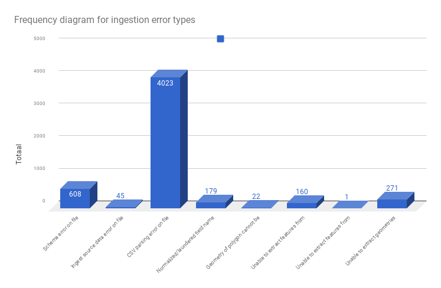
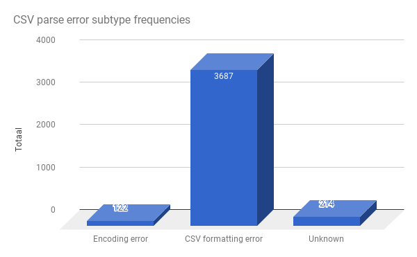

# First successfull run on all files
Today I ran a full ingest cycle on all data. Well, most of it was ingested earlier so I need to do a re-run on a fresh database. But still. Some statistics.

The data is a snapshot from all archaeological data tables from the [DANS e-depot](https://easy.dans.knaw.nl) of the 'unregistered' or 'registered user' (which I am) type. Basically any user with an account at DANS Easy will be able to download the files. The full set consists of 152,848 files:

```bash
rein@pvsge056:/data/EDNA-LD_EXT/easy_rest/downloads$ find . -type f | wc -l
152848
```

All 28,712 files of the .mid can be skipped. They are the data table counterparts to .mif files, read by GDAL:
```bash
rein@pvsge056:/data/EDNA-LD_EXT/easy_rest/downloads$ find . -type f -iname *.mid | wc -l
28712
```

152848 - 28712 = 124,136 to be ingested. After the first full run, the harvest is 118986 ingested files:
```
rein@pvsge056:/data/EDNA-LD_EXT/easy_rest/downloads$ mongo
MongoDB shell version v3.4.3
connecting to: mongodb://127.0.0.1:27017
MongoDB server version: 3.4.3
> use edna
switched to db edna
> db.files.count()
118986

```

So the ingestion success ratio is 118,986 / 124,136 = 0.958...
It ingested nearly 96% of the data!

# Uningesteable data
Still, there are 124,136 - 118,986 = 5,150 files that have not been ingested. It wouldn't be much of a scientific endeavour if I didn't try to explain or account for this dropout, even though it's pretty marginal.

I agreed with DANS to have all files marked as 'text' files. This includes files that aren't tables, but free text files as well. These files throw parse errors: 
```
2017-06-19 23:00:59,487 - ERROR - CSV parsing error on file /data/EDNA-LD_EXT/easy_rest/downloads/36645/2275582_giscodeboek_database.txt: Unable to parse file /data/EDNA-LD_EXT/easy_rest/downloads/36645/2275582_giscodeboek_database.txt: Could not determine delimiter
2017-06-19 23:01:01,700 - ERROR - CSV parsing error on file /data/EDNA-LD_EXT/easy_rest/downloads/36645/2275580_codeboek_steen.txt: Unable to parse file /data/EDNA-LD_EXT/easy_rest/downloads/36645/2275580_codeboek_steen.txt: Could not determine delimiter
2017-06-19 23:01:09,950 - ERROR - CSV parsing error on file /data/EDNA-LD_EXT/easy_rest/downloads/28691/1292443_giscodeboek_database.txt: Unable to parse file /data/EDNA-LD_EXT/easy_rest/downloads/28691/1292443_giscodeboek_database.txt: Could not determine delimiter
```

Some csv files just have the column headers, but nothing else:
```
2017-06-19 23:01:57,659 - ERROR - CSV parsing error on file /data/EDNA-LD_EXT/easy_rest/downloads/33658/1790214_setup.csv: Can't return dictionary from invalid csv file /data/EDNA-LD_EXT/easy_rest/downloads/33658/1790214_setup.csv
2017-06-19 23:01:57,782 - ERROR - CSV parsing error on file /data/EDNA-LD_EXT/easy_rest/downloads/33658/1790210_object.csv: Can't return dictionary from invalid csv file /data/EDNA-LD_EXT/easy_rest/downloads/33658/1790210_object.csv
```

The list of error types is, fortunately, pretty limited:

- **Schema** errors: schemas with key or value characters that cannot be ingested 
- **Ingest source data** errors: mostly files that are too large to ingest as a single document. These files allow fixing by changing the ingestion strategy on large files, splitting them. As they are very rare (45 / 124,136 = 0,036 % of the ingestable files) and seem to be mostly on large landscape analyses, they contribute little to searchable standard archaeological objects, so these will not be included.
- **CSV parsing** errors. These are by far the most common. These include the two examples above, but other errors as well.
- **Normalized/laundered field name** errors: I still have to debug this one, but it's pretty rare. Rare enough to allow skipping these files: they amount to 179 / 124,136 = 0,14% of files.
- **Polygon translation** errors: weird validation errors, exceedingly rare, these require manual fixing.
- **Feature extraction** errors: geospatial files that contain faulty or no data. Not to be fixed.
- **Unable to extract geometries** errors: geometry parsing errors. These require manual fixing.

The frequency for these error types on all data is as follows:
 


The source file for this chart is [here](https://github.com/reinvantveer/edna-ld/blob/master/etl/first-full-run.log.txt)
The chart itself can be accessed [here](https://docs.google.com/spreadsheets/d/1aZk-ikGE52UW5CMbV1KWJ22nCtW9f5TvKEcZPrrWpI4/edit?usp=sharing)

The schema errors should be fixable. They amount to errors like 
```
2017-06-19 12:00:04,582;ERROR;Schema error on file /data/EDNA-LD_EXT/easy_rest/downloads/48129/2917724_tbl_PathFormation.csv: 308 is not JSON serializable
2017-06-19 12:00:04,693;ERROR;Schema error on file /data/EDNA-LD_EXT/easy_rest/downloads/48129/2917719_tbl_BoneGnawing.csv: 261 is not JSON serializable
2017-06-19 12:00:04,928;ERROR;Schema error on file /data/EDNA-LD_EXT/easy_rest/downloads/48129/2917723_tbl_PathDestruction.csv: 308 is not JSON serializable
2017-06-19 12:00:04,974;ERROR;Schema error on file /data/EDNA-LD_EXT/easy_rest/downloads/48129/2917705_lut_BonePos.csv: 1 is not JSON serializable
```

Possibly these files do not have column headers, then they won't be parsable. With 608 occurrences, these types are negligeable.

## CSV parsing errors
The biggest exception category is the CSV parsing. Already quite a lot of work has gone into fixing CSV parsing errors. Let's look into those.



Again, there is one single dominant error type. In itself, it carries 3,687 / 5,150 = 71.59% of all total error throwing files. These errors are attributable to some kind of delimiter error: files for which no delimiter can be detected:

```
CSV parsing error on file /data/EDNA-LD_EXT/easy_rest/downloads/57727/4377121_UIKAV_Eindproduct_AlleTijdseries_AlleLegendas.prj: Can't return dictionary from invalid csv file /data/EDNA-LD_EXT/easy_rest/downloads/57727/4377121_UIKAV_Eindproduct_AlleTijdseries_AlleLegendas.prj
```
For this example, the file is a text file (a geospatial projection definition file), but not a csv file. These do not need to be fixed.

For these delimiter error files, only 570 (570 / 124,136 = 0,45 % of all ingestable files) actually have a .csv file extension:

```bash
rein@pvsge056:/data/EDNA-LD_EXT/easy_rest/downloads$ cat ~/Documents/git/edna-ld/etl/first-full-run.log.txt | grep 'CSV parsing error' | grep .csv | wc -l
570
```

A surprising lot 
```bash
rein@pvsge056:/data/EDNA-LD_EXT/easy_rest/downloads/32989$ cat ~/Documents/git/edna-ld/etl/first-full-run.log.txt | grep 'CSV parsing error' | grep .csv | grep Expected | wc -l
197
```
of them have CSV deserialization errors:
```
2017-06-19 23:00:32,279 - ERROR - CSV parsing error on file /data/EDNA-LD_EXT/easy_rest/downloads/48997/3071673_ARTF_STN.csv: Error tokenizing data. C error: Expected 2 fields in line 4, saw 5
```

So at first instance, a delemiter was found (probably a comma), but then on line 5, an extra `,` was found that throws off the parser. These require either manual fixing, automatic removal of the last comma on offending files.

It is very unlikely that the remaining 3,687 - 570 = 3117 (3117 / 5150 = 60.5 %) files can be fixed: these are files that are marked as text files in the Fedora repository software of DANS, but are not CSV tables.

# Conclusion
The ingestion of raw data tables was a success. 96% of the source files was ingested, and of the 4%, 61% is no CSV file. The rest isn't serialized properly, the encoding is hard to detect, the file is too large to ingest, have geometry problems or other issues that are too insignificant or to laborious to fix. So I'm keeping my score at 96% and I'm very happy to do so! 