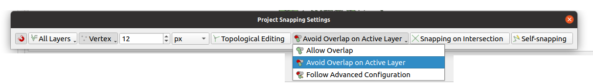

# TL;DR:

This post discusses how to design integration tests for python plugin scripts that target QGIS version something like
3.18. They were tested on 3.18. If you're targeting a newer version, things may not work as explained here.

1. Use [this Docker image](https://hub.docker.com/layers/qgis/qgis/latest/images/sha256-31926216a3bea81550a63accd5787592ddd602386ac5355a8e0a32e3b69c7385?context=explore)
to run your integration tests
1. Derive your own Dockerfile from this image, copy your plugin and tests into the image
1. Install the plugin to `/QGIS/build/output/python/plugins` (possibly subject to future change)
1. Add the path `/QGIS/build/output/python/plugins` to the PYTHONPATH
1. Add an integration test script containing a `def run_all()` function. This function is expected to be present. 
1. Inside the `run_all()` function, instantiate your plugin using the `classFactory` function. This is what QGIS would
   normally call as well to instantiate your plugin and it should be part of the integration test to verify it's working
   correctly.
1. Put your (calls to) integration tests in this function.
1. Add a `print('Ran OK')` line in your test, otherwise the integration script will not recognize the test as successful.
1. `COPY` over the integration test to the image
1. `RUN` the test using `RUN xvfb-run qgis_testrunner.sh {insert_your_test_script_filename}` _without_ the .py
   file extension!
1. Sit back and observe all the black magic unfold.

# QGIS is awesome

QGIS, as a (the?) premier GIS client software - is one of my favorite open source projects. Not just because I'm a
geospatial developer/researcher but also because it's both well-maintained and I have seen the fantastic development it
has gone through over the previous years. It gained a ton of features and a lot more stability along the way. Not that
there's no rough edges, but rough edges are in _any_ piece of software basically, it's why software (like art, a quote
attributed to Da Vinci) is never truly finished (it just gets abandoned at some point).

I have been a long-term user of QGIS although I never acquainted myself with all the nooks and crannies of the package.
However I recently followed an (internal) masterclass on using the
fancy [Atlas](https://www.qgistutorials.com/en/docs/automating_map_creation.html) feature that lets you auto-generate
templated fancy cartographic layouts of your data. Nowadays I'm more of a "what did I actually produce using this
{script,query,export}?" user of QGIS, but I did extensive mapping and editing previously and I found it an extremely
useful tool for the job. Particularly helpful for example is
the [setting where new polygon parts overlapping with already present objects can be automatically clipped (see tutorial part 15-17)](https://www.qgistutorials.com/en/docs/3/digitizing_basics.html#procedure)
, then select "Avoid overlap on active layer":



For heavy digitigers, this option will save you hours of work and delivers clean maps with non-overlapping polygons.

But I digress.

# QGIS plugin development

My Python skills have come to fruition only relatively recently over the past couple of years, and pure out of curiosity
I started doing some research on what the current state of Python plugin development for QGIS is at the moment. I
started with a simple goal: just to learn some stuff about QGIS plugins in Python and have some fun along the way (
mission: accomplished), but I also decided not to back down on the more complicated stuff. I created a plugin
called [Namari](https://github.com/reinvantveer/namari) that allows you to
do [anomaly detection](https://en.wikipedia.org/wiki/Anomaly_detection) on geospatial data.

So, I took to
the [docs](https://docs.qgis.org/testing/en/docs/pyqgis_developer_cookbook/plugins/plugins.html#writing-a-plugin) which
recommends using the [plugin builder](https://plugins.qgis.org/plugins/pluginbuilder3/) to get started. I must say that
this plugin builder is phenomenal to get started with creating your own plugins. It bootstraps an absolute ton of
resources for you, but perhaps a little on the heavy side - it's easy to get overwhelmed by the amount. I also created
some [level of discussion on the current state of this plugin builder](https://github.com/qgis/QGIS-Enhancement-Proposals/issues/223)
.

Now, I've become something of a testing enthusiast over the years. I think it has to do a lot with both research
reproducibility and product stability. Tests allow you to formally verify that something does what it is expected to do,
which often makes me wonder why so little unit/integration testing is done in research.

It probably has a lot to do with the fact that writing good tests is very hard. I can tell, because I do a lot of it.
But if it were _only_ hard, I wouldn't be doing it. Writing tests offers me a level of satisfaction that I cannot reach
from writing working software alone. Testing doesn't offer _every_ guarantee: your software is stable only to the level
of tests can verify and then it still doesn't protect from misuse. But even more than some level of proven correctness,
I truly believe testing can be fun, because of the main goals I set for myself: just to learn stuff.

And boy does testing stuff get you to learn stuff. I'd almost say that writing tests is maybe the single most effective
way of learning about library APIs and the inner workings of your own code doodles. None more so than for writing
integration tests for QGIS plugins. So here we go.

# QGIS plugin integration testing

Doing unit testing on parts of the plugin is all fine and dandy, but I wanted to do a little bit more than just that.
After all, a QGIS plugin often has some kind of interaction with the graphical user interface of QGIS. So, how do we
test this interaction?

The answer is through integration testing with a working QGIS instance. Now this is where things get quite complex. QGIS
offers a `qgis` python package installed in the site-packages of the Python version used by QGIS. But importing this in
a stand-alone Python script doesn't get you a fully working QGIS instance, it's just a reference to a module that's
intended to run as an _embedded Python process_. So, this process needs to be tied to a running QGIS instance if you
want to make use of its full range of capabilities.

### The `iface` object

Central in the understanding of the connection between the Python `qgis` namespace and the QGIS app is the notion of
the `iface`. This `iface` object can be accessed from a running QGIS Python console (just press Ctrl-Alt-P to start
one):


This `iface` object gives you an instance of a `qgis.gui.QgisInterface`, which kind of is the bridge between a plugin and
events in QGIS. This is why practically all QGIS Python plugins are instantiated by passing (or you could say
dependency-injecting) this `iface` object into the plugin constructor.

But you're getting none of this `iface` goodness just by unit testing. The plugin builder side-steps this problem by
offering
a [stubbed QGIS interface object](https://github.com/g-sherman/Qgis-Plugin-Builder/blob/master/plugin_templates/shared/test/qgis_interface.py#L37)
, but of course this doesn't do much unless you re-create a lot of the functionality here yourself. But that is both
tedious and unhelpful: we want to validate the workings of our plugin in a _real_ QGIS environment, not in a stub. How
are we going to check whether it will work in the wild otherwise?

The hunt for this elusive `iface` object is documented on several
places: [here is my own](https://gis.stackexchange.com/questions/392254/pyqgis-iface-object-for-layer-event-handling-in-qgis-plugin-testing)
, but others have hit this as well [here](https://github.com/qgis/QGIS-Documentation/issues/3776)
and [here](https://gis.stackexchange.com/questions/380678/alternative-of-iface-for-standalone-pyqgis-application). After
a lot of searching and trying, I managed to come up with a solution that will work almost everywhere.

### Ingredient number one: a Dockerfile

For quite some time now, I have been using Docker as a very helpful development tool. Docker isn't just handy for
packaging and shipping, it's also very versatile as part of a development toolchain. The reason is that it:

- allows you to build on your own or others' previous work, the whole standing on shoulders of giants (including your
  own :) thing
- allows you to mess up you build environment _inside an isolated environment_ without having to deal with the fallout
  of a broken development system. If your development environment inside Docker made a mess, then just rinse and repeat
  without any sweat
- allows you to make reproducible builds much more easily. If you can get it to work on your local Docker env, whether
  you built on Linux, Mac or Windows, it will probably work on something like GitHub
  actions/Travis/Jenkins/TeamCity/Gitlab CI/CircleCI or whatever CI system you're using. There's no self-respecting CI
  system that doesn't support Docker.
- allows you to just remove the test image you built from your local machine and get rid of _every last bit_ of
  toolchain you needed for your project and leave with a clean local system. I cannot tell you how many times I screwed
  up my machine setting up all kinds of weird build toolchains that started to get into version conflicts and having no
  clue on how to untangle things other than just to uninstall the whole lot (or worse, just flush my machine OS).

In this case I think it's definitely worth using the
official [QGIS latest Docker image](https://hub.docker.com/layers/qgis/qgis/latest/images/sha256-31926216a3bea81550a63accd5787592ddd602386ac5355a8e0a32e3b69c7385?context=explore)
for the integration testing. It has all the assets you need to get started designing integration tests. You could use
your own local QGIS installation but the trouble is of course that when you copy or remove the wrong files or to the
wrong location, you end up with a broken QGIS (or worse). So, for development and experimentation, I find a Docker image
to be ideal. So: start your own Dockerfile with
```dockerfile
FROM qgis/qgis:release-3_18  
# Or whatever version you're targeting
```

You can even parameterize the release version, so you can test your plugin against multiple QGIS versions without having
to install them:

```dockerfile
ARG VERSION
FROM qgis/qgis:release-$VERSION  
# Or whatever version you're targeting
```

and then build using `docker build -t my_plugin:newer --build-arg VERSION=3_18`

## Ingredient number two: a special integration test script

Second aspect of our integration test toolchain is a special python script that can be executed by
a [`qgis_testrunner.sh`](https://github.com/qgis/QGIS/blob/master/.docker/qgis_resources/test_runner/qgis_testrunner.sh)
 script that is present in the QGIS Docker image by default. You can call your python script anything you want, but
the minimal requirement is that:
- it can be found by the `qgis_testrunner.sh` shell script, 
- that it has a `run_all()` function (having no parameters, returning nothing) and 
- that at some point it emits a `Ran` and `OK` through standard out.

The most simple test script that can be ran by the test runner inside the docker image is thus:
```python3
def run_all():
    print('Ran OK')

```

However, this test script is capable to do a lot more: it is able to instantiate our plugin with an actual `iface`
interface to the QGIS application!

```python
from qgis import utils
from namari import classFactory


def run_all() -> None:
    print('Hello QGIS!')

    plugins = utils.plugins
    assert utils.iface is not None, 'This test needs an actual iface interface to QGIS'
    plugins['namari'] = classFactory(utils.iface)
    print(plugins)

    print('Ran OK')

```

So, this script will not only verify that we have a _real_ `iface` object instead of a stubbed or empty one, but it will
also instantiate our plugin (called `namari`) to hook directly into the QGIS application. For comparison: you can
import `iface` from `qgis.utils` at any time from any python script, but the `iface` object will be `None` unless you
import it inside a running QGIS application - or from this  `qgis_testrunner.sh`.
