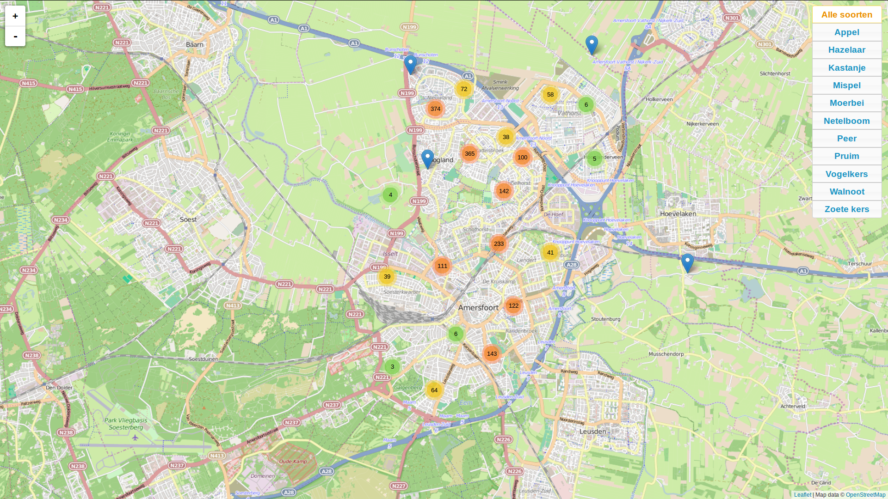

# The fun of live demos
As skills go, there is no better way to show them by giving live demos. They are a living testament to your knowledge and talents. Here goes.

## Datathon geostatistics app
In a four-day datathon co-op event by Centraal Bureau voor de Statistiek (Dutch statistics office) and Kadaster (the national Cadastre) I collaborated with a few colleagues on geostatistical analysis of 'krimpgebieden' ('shrinkage' areas) in the Netherlands. There's some very nice spatial thematic mapping using SPARQL and [YASGUI](https://github.com/OpenTriply/YASGUI) at our demo here: [https://data.labs.pdok.nl/stories/krimp](https://data.labs.pdok.nl/stories/krimp).

## Award-winning data journalism app
For a hackathon challenge by the [Platform Linked Data Netherlands](http://www.pldn.nl), together with a few mates I made a demo application on drone strikes, all client side here on [linked data journalism](https://linkeddatajournalism.github.io). This demo was the main inspiration for the [Cadastre data stories](https://data.labs.pdok.nl/stories/).

## A spatial semantic web demo
For [Platform Linked Data Netherlands](http://www.pldn.nl), I developed a research application based on a use case as real as one could imagine, but still on an experimental basis. The reason for exploring is as follows: there is an enormous potential waiting in building semantic web applications that leverage spatial search. For this, we explored the following use case. 

Imagine there are thousands of monuments, buried underground. This is no fiction: our country is riddled with archeological sites that have not been excavated and lie waiting for us to go hunting for. For many of them, we know their exact location. These sites are vulnerable. For instance: we should prevent building activities from destroying them, and we want to keep them as intact as they are. Unfortunately, there are also factors that are not so easily controlled, but they can be monitored. For instance: the ground water level. By keeping tabs on the water level indicators, we can tell if there are significant changes in them. Those changes are bad: they are detrimental for these archaeological because they cause the organic materials to rot. Each time the water level drops and rises, it exposes the remains to oxygen, deteriorating the quality of site. By monitoring the water levels, we can tell which sites are most exposed and maybe need excavating, despite the absence of building activities.

The demo can be found running [here](http://www.bureaudigitaalerfgoed.nl/peilbuizen)

The source code is [here](https://github.com/erfgoed-en-locatie/Archeo-Peilbuizen-PoC)

## Publishing open spatial government data: fruity Amersfoort
A lot of spatial data is made available by government organisations. Lacking the means to publish them 'live', a lot of these organisations simply offer a data dump, leaving the processing to the end user. For data sets formatted as simple tables (csv for example), this is not problematic. For spatial data however, it can hardly be asked from the general public to be able to open and process the data stored in geojson or shapefiles. Although [QGIS](http://www.qgis.org) has done a lot to further the public opportunities to inspect spatial data sets, it is by no means a generally understood and known application. 

See the live demo here: [http://reinvantveer.github.io/fruitig-amersfoort/](http://reinvantveer.github.io/fruitig-amersfoort/)

So, [Github pages](https://pages.github.com) can be of a lot of interest here: they are a means of easy and open publishing of data. Any geojson file pushed to a repository is automatically rendered on a leaflet map. This is of enmormous value. To explore this, I pushed the [open data set of fruit-bearing trees](https://data.overheid.nl/data/dataset/bomen-met-eetbare-vruchten-gemeente-amersfoort) in my home town of Amersfoort. Although the data is published CC-0, I want to commend the municipality of Amersfoort for being so kind as to supply their data to the general public.

However, there are some drawbacks to the way Github generates these maps. There are no ways of filtering data, so if you have around 2000 fruit trees in your data set, the whole application becomes rather cluttered, despite the nice clustering strategies Leaflet employs. Here's the [Github rendering](https://github.com/reinvantveer/fruitig-amersfoort/blob/gh-pages/assets/data/fruitig-amersfoort.geojson), to be viewed on a desktop (not mobile) device.

By adding a few interface elements, the viewing is greatly improved. [See my additions here](http://reinvantveer.github.io/fruitig-amersfoort/).
The source code is found [here](https://github.com/reinvantveer/fruitig-amersfoort). The demo is intended as a one-day project: a project that consumes no more than eight hours of development to be useful. I think I spent just a little over eight hours, just to get the data rich enough (only latin species names were supplied in the source data) to be of public use.