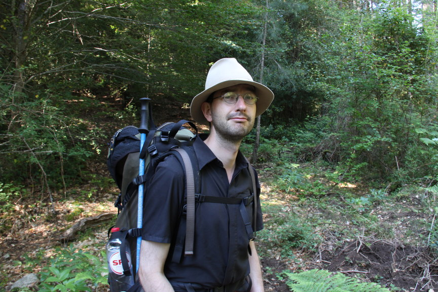

    <h1>Personal professional pages for Rein van 't Veer</h1>
    

    
Rein van 't Veer is a heritage professional, specialised in application and data development. He is working both freelance and employed directly, mainly by heritage institutions or organisations directly or indirectly related to them.

    

  <h1 class="page-heading">Posts</h1>

  <ul class="post-list">
    
      <li>
        {{ post.date | date: "%b %-d, %Y" }}

        <h2>
          <a class="post-link" href="{{ post.url | prepend: site.baseurl }}">{{ post.title }}</a>
        </h2>
      </li>
    
  </ul>

  
subscribe <a href="{{ "/feed.xml" | prepend: site.baseurl }}">via RSS</a>

