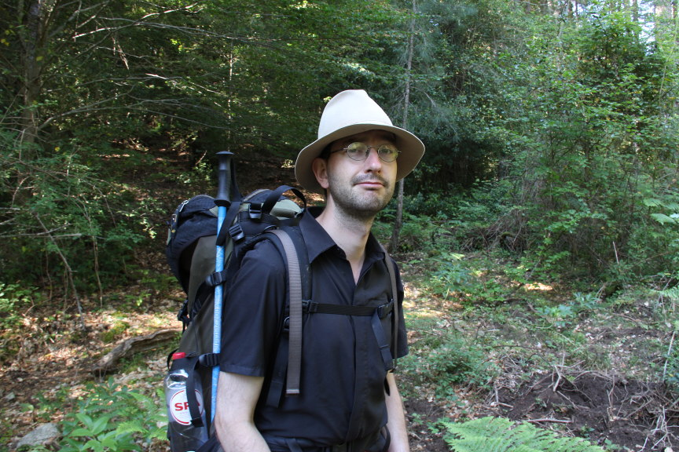

     
    

    <h2>Rein van 't Veer, geospatial data scientist and semantic web developer</h2>
    
Geospatial data scientist, specialised in (linked) geo data engineering, geospatial machine learning, and geo web application development. Working for <a href="https://geodan.nl">Geodan</a> in the Netherlands.

    

  <h1 class="page-heading">Posts</h1>

  <ul class="post-list">
    
      <li>
        {{ post.date | date: "%b %-d, %Y" }}
        <h3>
          <a class="post-link" href="{{ post.url | prepend: site.baseurl }}">{{ post.title }}</a>
        </h3>
      </li>
    
  </ul>

  
subscribe <a href="{{ "/feed.xml" | prepend: site.baseurl }}">via RSS</a>

